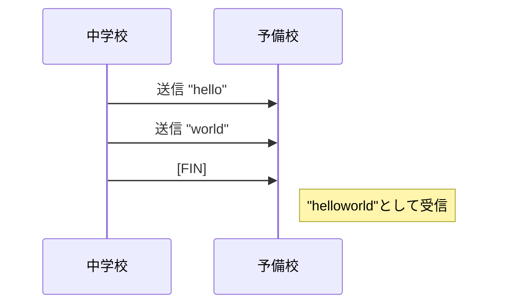
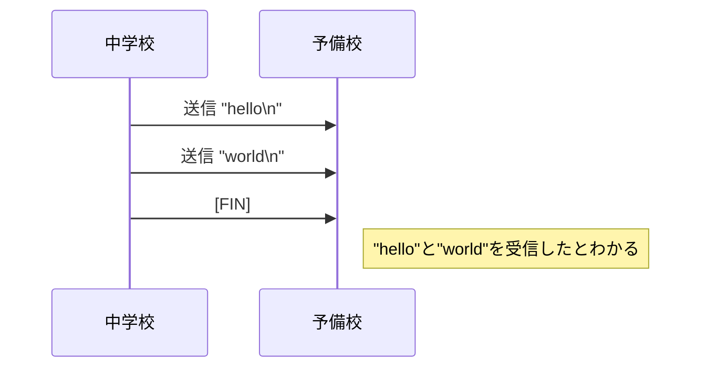

# セキュリティ情報学実験 コンテンツセキュリティ 教材テンプレート

注意: 必要な情報をすべて載せているわけではありません。適宜検索してください。なお要件を満たしていればテンプレートの内容に必ず従う必要はありません。

中学校・予備校PPDMプログラムのGo言語テンプレートです。次のようなディレクトリ構成になっています。

```
.
├── README.md
└── contentssecurity
    ├── go.mod
    ├── go.sum
    ├── kadai1
    │   └── main.go
    ├── kadai2
    │   └── main.go
    ├── lib.go
    ├── omomi.txt
    ├── saiteiten.txt
    └── seiseki.txt
```

| ファイル名         | 説明                                                   |
| :----------------- | :----------------------------------------------------- |
| README.md          | 本ドキュメント                                         |
| go.mod 及び go.sum | Golangプロジェクトを構成するためのファイル群           |
| kadai1/main.go     | 非PPDM、PPDMプログラム用テンプレート (1週目で使用)     |
| kadai2/main.go     | TCP通信テンプレート (2, 3週目で使用)                   |
| lib.go             | 各種処理をまとめておくパッケージ                       |
| omomi.txt          | 予備校が持つ重み行列を保存したCSVファイル (秘匿対象)   |
| saiteiten.txt      | 各高校の合格最低点を保存したCSVファイル                |
| seiseki.txt        | 中学校が持つ生徒の成績を保存したCSVファイル (秘匿対象) |

## 事前準備

IED環境で本テンプレートを使用しプログラムをビルドする前に、ターミナル(端末エミュレータ)からいくつかのコマンドを実行する必要があります。

以降本ドキュメントではターミナル(bash)でのコマンド実行を

```bash
$ コマンド
```

のように書きます。bashの文法としてはシェルスクリプトのみにしか用いられませんが、`#`以降はコメントとします。(rootユーザ実行を表しません。)

`$`が付いていない行は想定される出力です。

### 環境変数の設定

IED環境で`go get`コマンドや`git`コマンド、`curl`コマンド等を使用するためには、プロキシの設定をする必要があります。

また、`go get`コマンドで取得した実行ファイルを使用するために、パスを通す必要があります。

以上を行うため、bashで下記コマンドを実行してください。

(同設定がすでに存在する人は実行する必要はありません。また`.profile`をエディタで編集して追記しても問題ありません。)

```bash
$ echo 'export PATH="$HOME/go/bin:$PATH"' >> ~/.profile
$ echo 'export http_proxy=http://proxy.uec.ac.jp:8080' >> ~/.profile
$ echo 'export https_proxy=http://proxy.uec.ac.jp:8080'  >> ~/.profile
$ source ~/.profile
```

### 最新版のgoの取得

IED環境で使えるgoは`apt`で取得されているため少し古いものになっています。以下のようにしてバージョンを確認できます。

```bash
$ go version
go version go1.13.8 linux/amd64
```

そのため、新しいgoの導入を推奨します。`gonum`等外部モジュールを使用したい場合ほぼ必須になります。

```bash
$ go get go1.19.3
$ go1.19.3 download
```

バージョン1.19.3のgoを実行するには、`go1.19.3`コマンドを`go`コマンドの代わりに使用する必要があります。

`1.13.8`は使わないので、エイリアスを設定しましょう。

```bash
$ echo 'alias go=go1.19.3'  >> ~/.profile
$ source ~/.profile
```

バージョンを確認して`1.19.3`と表示されることを確認してください。

```bash
$ go version
go version go1.19.3 linux/amd64
```

### goのコマンド

講義で使用する可能性があるgoのコマンド集です。`go.mod`ファイルが存在する`contentssecurity`ディレクトリ以下で実行してください。

| コマンド名                            | 効果                                                                                             |
| :------------------------------------ | :----------------------------------------------------------------------------------------------- |
| go run (main関数のあるGoファイルパス) | コンパイルし、実行します。                                                                       |
| go build (main関数のあるGoファイル)   | コンパイルのみ行い実行ファイルを生成します。実行ファイル作成は仮想環境での実行のために必要です。 |
| go get (モジュールのURL)              | 外部モジュールを使用するためのコマンドです。                                                     |
| go mod tidy                           | 依存関係解決のためのコマンドです。`go get`コマンドを打った後に実行してください。                 |
| go version                            | goのバージョンを確認します。                                                                     |
| go help                               | そのほかのgoコマンドについて調べられます。                                                       |

詳しい仕様・内容については各自で調べてください。

またGo言語については公式である [A Tour of Go](https://go-tour-jp.appspot.com/) が参考になります。

以下に、特に本講義のプログラムに関係が深そうなページを列挙しておきます(目を通すのは調べたい時だけで良いです)。公式サイトは列挙されているかにかかわらず自由に参照しましょう。

- 基本事項
  - [Packages](https://go-tour-jp.appspot.com/basics/1)
  - [Imports](https://go-tour-jp.appspot.com/basics/2)
  - [Exported names](https://go-tour-jp.appspot.com/basics/3)
  - [Functions](https://go-tour-jp.appspot.com/basics/4)
  - [Multiple results](https://go-tour-jp.appspot.com/basics/6)
  - [Variables with initializers](https://go-tour-jp.appspot.com/basics/9)
  - [Short variable declarations](https://go-tour-jp.appspot.com/basics/10)
  - [Basic types](https://go-tour-jp.appspot.com/basics/11)
  - [For](https://go-tour-jp.appspot.com/flowcontrol/1)
  - [If](https://go-tour-jp.appspot.com/flowcontrol/5)
  - [Struct](https://go-tour-jp.appspot.com/moretypes/2)
- 本講義で特に関連
  - [Defer](https://go-tour-jp.appspot.com/flowcontrol/12) : TCPコネクションの接続を切断する`Close()`の呼び出しに使っています。
  - [Arrays](https://go-tour-jp.appspot.com/moretypes/6)
  - [Slices](https://go-tour-jp.appspot.com/moretypes/7)
  - [Creating a slice with make](https://go-tour-jp.appspot.com/moretypes/13) : `[][]float64`は`make`関数を用いて動的に(ヒープに)確保するのが便利です。
  - [Range](https://go-tour-jp.appspot.com/moretypes/16)
  - [Methods](https://go-tour-jp.appspot.com/methods/1)
  - [Goroutines](https://go-tour-jp.appspot.com/concurrency/1) : `kadai2/main.go`に記載のある`demo`関数のように、一度のプログラム実行で両方の役を演じるのに便利です。
  - [Channels](https://go-tour-jp.appspot.com/concurrency/2)

### 本テンプレートの取得

テンプレート自体に付属するREADME.mdとして本ドキュメントを配布していますが、README.mdのみ別手段で共有されている場合を考慮し、テンプレート自体の取得方法についても言及します。

本テンプレートはGitHubにて公開されているため、次のコマンドで取得できます。プロジェクトを置きたいディレクトリに移り、次を実行します。

```
$ git clone https://github.com/uecconsecexp/secexp2022_template.git
```

そのままでも支障はありませんが、テンプレートディレクトリの名前は`mv`コマンドでわかりやすいものに変えましょう。

また本テンプレートはWebClassでも配布予定です。

## 1週目および2週目: 計算部分の実装

### 非PPDMプログラム: `kadai1/main.go`

中学校側・予備校側等の役割分担は気にせず、行列計算を行い、生徒の合否判定を行うプログラムを作成してください。

- 入力: 成績行列( `seiseki.txt` )、重み行列( `omomi.txt` )、合格最低点( `saiteiten.txt` )
- 出力: 適性行列、合否行列を標準出力してください。

処理手順

1. 各種ファイルの読み込み
    - `os`パッケージおよび`encoding/csv`パッケージを使うことで楽に読み込めます。
2. 成績行列と重み行列の行列積を計算し、適性行列とする
    - 行列積は実装するか、`gonum`等の行列計算用のモジュールを導入して行いましょう。
3. 適性行列と合格最低点との比較により、合否行列を計算
    - `true`を`1.0`、`false`を`0.0`として`float64`の配列で送受信できるようにしておきます。
    - 生徒の重み付き合計点 >= 合格最低点で比較をします。合格最低点ちょうどの生徒は合格とします。
4. 適性行列、合否行列を出力し、想定した値と合致しているかを確かめます。

`kadai1/main.go`を作成する目的は、Go言語に慣れること、ファイルロード、行列計算の仕組みを整えることにあります。

### PPDMプログラム: `kadai2/main.go`

パートナーとなった人と中学校役・予備校役に分かれてPPDMプログラムを作成します。

`lib.go`ファイルにそれぞれの役のための関数が定義されています。分担してのプログラミングとなりますが、余力がある人は両方実装することで`main.go`で定義されている`demo`関数を使用し一人でもPPDM通信を検証することができます。

- 予備校側入力: 重み行列( `omomi.txt` )、合格最低点( `saiteiten.txt` )
- 予備校側出力: 途中計算について標準出力してくだされば良く、必須の出力はありません。

- 中学側入力: 成績行列( `seiseki.txt` )
- 出力: 途中計算についての標準出力及び、最終的な合否行列の標準出力をしてください。

処理についてはスライドに記載されたPPDMアルゴリズムを参考に各自で考えてください。

以下はヒントです。

- 共通ヒント
  - 行列を上下または左右に分割するプログラムが必要です。

- 予備校側ヒント
  - 逆行列計算が必要です。
    - `gonum`モジュールを使用する
    - 独自実装する: 掃き出し法、LU分解、ヤコビ法等

- 中学校側ヒント
  - 乱数行列の用意が必要です。
  - `gonum`モジュールに該当する機能はないため、`math/rand`等を用い独自実装する必要があります。

逆行列を求めることを考慮すると、予備校側のほうが実装が大変であると言えます。

(正則な乱数行列の送信を考慮すると中学校側でも乱数行列の逆行列の存在を確かめるように実装するべきかもしれません。どれだけ実装するかはパートナーと決めてください。)

## 3週目: 通信部分の実装

3週目では、パートナーとTCP通信によってPPDMアルゴリズムが実際に行えることを確かめます。

講義の流れ上3週目としていますが、PPDMプログラムが完成していなくとも接続確認は行えます。パートナーと齟齬が起きないよう1週目・2週目の段階で予め通信確認することを推奨します。

### 仮想環境について

PPDM通信の検証にはIEDの仮想環境を使用します。

ホストはlinux01～linux30まであります。使用する端末は割り当てられたものにしてください。IEDのターミナルからsshすることで接続します。

- ホスト名: linux〇〇
- ユーザ名: root
- パスワード: ホスト名と同じ

linux01が割り当てられた人はホスト名`linux01`、パスワードは`linux01`になります。以降`linux〇〇`は自分の割当ホストに読み替えてください。

ホストには`ssh`コマンドを打ちパスワードを打って接続します。

```bash
$ ssh root@linux〇〇
# パスワードの入力を求められます。
```

sshは`logout`コマンドで終了できます。

IEDで作成したPPDM実行バイナリ及び入力データは、仮想環境にコピーして実行します。

```bash
# contentssecurityディレクトリにて
$ go build kadai1/main.go
# 実行ファイルmainができます。
$ cd ..
# 取捨選択してコピーしても良いですが、プロジェクトごとコピーしてしまいましょう
$ scp -r contentssecurity root@linux〇〇:~/
# パスワードの入力を求められます。
```

コピーした`main`が実行できることを確認します。

```bash
$ ssh root@linux〇〇
# 以降実際のプロンプトは`#`でありroot実行
$ cd ~/contentssecurity
$ ./main
```

### 通信方法

最終的に作成していただきたいのは、パートナーの仮想環境とTCPソケット通信を行うプログラムになります。

本講義用に用意したモジュール`github.com/uecconsecexp/secexp2022/se_go`を使用します。(テンプレートではすでに`go get`で取得済みです。)

以下、`se_go/connector`にて公開されている構造体・関数等の一覧です。

| 名前                                                       | 分類   | 役割                                                                                                    |
| :--------------------------------------------------------- | :----- | :------------------------------------------------------------------------------------------------------ |
| YobikouServer                                              | 構造体 | 予備校側で使用する構造体です。データの送受信を担います。                                                |
| NewYobikouServer() (YobikouServer, error)                  | 関数   | `YobikouServer`のコンストラクタです。中学校が接続してくるのを待ちます。                                 |
| YobikouServer.Close() error                                | 関数   | TCPコネクションを閉じます。最後に必ず呼び出す必要があります。(`defer`文を使用しましょう)                |
| YobikouServer.Send(data []byte) error                      | 関数   | バイト配列 `[]byte` を送信します。文字列は`[]byte("hoge")`のようにキャストすることで送れます。          |
| YobikouServer.Receive() ([]byte, error)                    | 関数   | バイト配列が送信されてくるのを待ち、受信します。                                                        |
| YobikouServer.SendTable(table [][]float64) error           | 関数   | 行列 `[][]float64` を送信します。                                                                       |
| YobikouServer.ReceiveTable() ([][]float64, error)          | 関数   | 行列が送信されてくるのを待ち、受信します。                                                              |
| ChugakuClient                                              | 構造体 | 中学校側で使用する構造体です。データの送受信を担います。                                                |
| NewChugakuClient(serverAddr string) (ChugakuClient, error) | 関数   | `ChugakuClient`のコンストラクタです。予備校側のIPアドレスを引数として受け取り、予備校にアクセスします。 |
| ChugakuClient.Close() error                                | 関数   | TPCコネクションを閉じます。以降の関数の説明はYobikouServerと同じため省略します。                        |
| ChugakuClient.Send(data []byte) error                      | 関数   | 省略                                                                                                    |
| ChugakuClient.Receive() ([]byte, error)                    | 関数   | 省略                                                                                                    |
| ChugakuClient.SendTable(table [][]float64) error           | 関数   | 省略                                                                                                    |
| ChugakuClient.ReceiveTable() ([][]float64, error)          | 関数   | 省略                                                                                                    |

実際にどのように使うかは`lib.go`にあるプログラムを参考にしてください。

ポイントは2点です。

- 予備校側でサーバーを立ち上げてから中学校側が予備校サーバーのIPアドレスにアクセスします。すなわち、**予備校役の学生が先にプログラムを実行します**。
- 中学校側は`NewChugakuClient`関数で予備校サーバーのIPアドレスを引数として渡す必要があります。IPアドレスをプログラム中で扱う方法はいくつかあります。
  - 方法1. ハードコードする: 通信相手のIPアドレスをプログラム中に直接記載します。簡単にプログラムが書ける一方、都度コンパイルが必要なため非推奨です。
  - 方法2. 環境変数(`.env`ファイル使用)で渡す: 相手のIPアドレスは変わるものではないので、この方法がおすすめです。`godotenv`モジュールと`os.Getenv`関数で実現できます。
  - 方法3. コマンドライン引数で渡す: 実行時に`./main 192.168.128.101`のように指定する方法です。柔軟性があります。`flag`パッケージ等で実現できます。
  - 方法4. 標準入力で渡す: 実行後にIPアドレスを尋ねる方法です。都度入力しなければならないため非推奨です。 `fmt.Scan`で実現できます。

#### IPアドレスについて

予備校側のホストのIPアドレスは、`192.168.128.1〇〇`というフォーマットになっています。例えばホストlinux01が予備校サーバーである場合IPアドレスは`192.168.128.101`です。

IPアドレスは仮想環境上で`ip -4 a`コマンドを実行することで確認できます。

```bash
$ ip -4 a
1: lo: <LOOPBACK,UP,LOWER_UP> mtu 65536 qdisc noqueue state UNKNOWN group default qlen 1000
    inet 127.0.0.1/8 scope host lo
       valid_lft forever preferred_lft forever
2: ens160: <BROADCAST,MULTICAST,UP,LOWER_UP> mtu 1500 qdisc fq_codel state UP group default qlen 1000
    inet 192.168.128.101/24 brd 192.168.128.255 scope global ens160
       valid_lft forever preferred_lft forever
```

## その他参考情報

本節は知っていると作業が楽になるかもしれない情報を載せます(主に遠隔で演習を行うための方法です)。ただし触れるだけに留めていますので詳細は調べたり人に尋ねたりしてください。

- IEDではVSCodeが使用できます。
- IEDのマシンは学内LANから[リモートで起動](http://termsrv.ied.inf.uec.ac.jp/)でき、SOLを踏み台にしてSSHで接続することが可能です。
  - リモート起動ページのみにVPNが必要です。
  - 踏み台設定: https://qiita.com/hkak03key/items/3b0c4752bfbcc52e676d
- VSCodeに存在する拡張の一つである[Remote-SSH](https://code.visualstudio.com/docs/remote/ssh)を使うことで、SSH接続できるホスト上のファイルを、VSCodeで編集することが可能です。
- Remote-SSHは踏み台経由でも使えます。
- VSCodeにはGoの拡張もありますが、IED環境のGoは古いため、少し設定が必要です。
  - Goの拡張を利用してVSCodeをメインに開発を行う場合、先述したエイリアス設定を消しましょう。
  - Goのバージョンを切り替える機能を利用します。: https://qiita.com/frozenbonito/items/f8569e7afd17ea76b1ab

## APPENDIX(読む必要はありません。): TCP通信の仕様について

本節では本テンプレートが今後受け継がれていくことを見越し、本演習のために用意したTCP通信の細かい仕様を残します。

演習のために知る必要は全くありません。

### モジュールについて

TCP通信を行うモジュールは https://github.com/uecconsecexp/secexp2022 にあります。テンプレートではこのサイトからコードを取得しています。

本ドキュメントに書かれていない詳細はこのリポジトリにあるコードを読んで得てください。

### TCP通信について

予備校側のホストがポート10000番を開け、そこにクライアントとして中学校側が接続します。通信環境によってはファイアウォール設定を変える必要があるでしょう。

(なぜポート10000を使用しているのかは、元となるJavaコードを引き継いだTAである筆者は存じ上げません。)

TCPソケット通信はEOFが来て通信を閉じるまでバイト同士を**単純に**送受信し合うようにできています。

何を意味するかというと、デフォルトではどこまでが1回の送信・受信であるかに決まりはなく、片側から複数連続で送信を行うと、どの送信がどのデータを含むのかわからなくなってしまいます。



そのため送信されてきたデータにはデリミタとして改行を入れることにしました。(改行である必要はありませんでしたが、一般的なデリミタということで採用しています。)



送信データ自体が含む改行は、`\n`は`\\n`に、`\r\n`は`\\r\\n`にそれぞれエスケープしています。

1回の通信の流れ

- [送信側] 送信データの改行をエスケープする。
- [送信側] 送信データの最後に改行を入れる。
- [送信側] 送信する。
- [受信側] 受信する。
- [受信側] 改行までを取り出す。
- [受信側] 受信したデータのエスケープを元に戻す。

### 行列の送受信について

行列を直接バイト列にして変換すると環境間での互換性が失われてしまうことを考慮し、行列は次のJSONフォーマットを施した文字列の形で送受信する仕様になっています。

以下は2×2の場合の例です(読みやすく改行を入れています)。サイズは任意です。

```json
{
    "data": [
        ["1E+00","2E+00"],
        ["3.141592653589793E+00","3.010299956639812E-01"]
    ]
}
```

文字列の二次元配列である`data`フィールドを持つJSONオブジェクトでやり取りします。

浮動小数点( `float64` )を文字列にするのは、各環境での橋渡しをしやすいようにするためです。

なお、Go言語において浮動小数点を文字列に変える操作は`strconv.FormatFloat(数値, 'E', -1, 64)`で行っており、指数表現になっています。